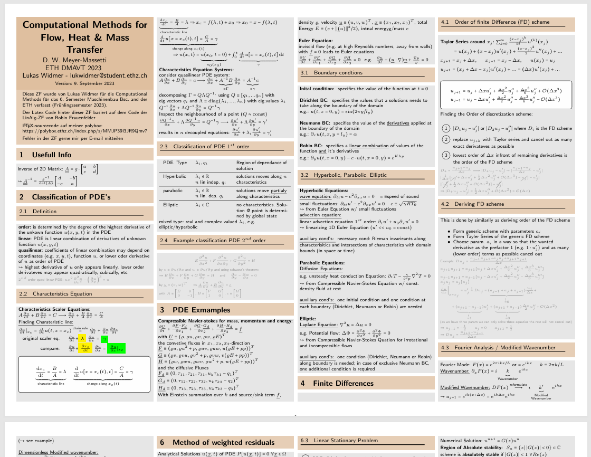
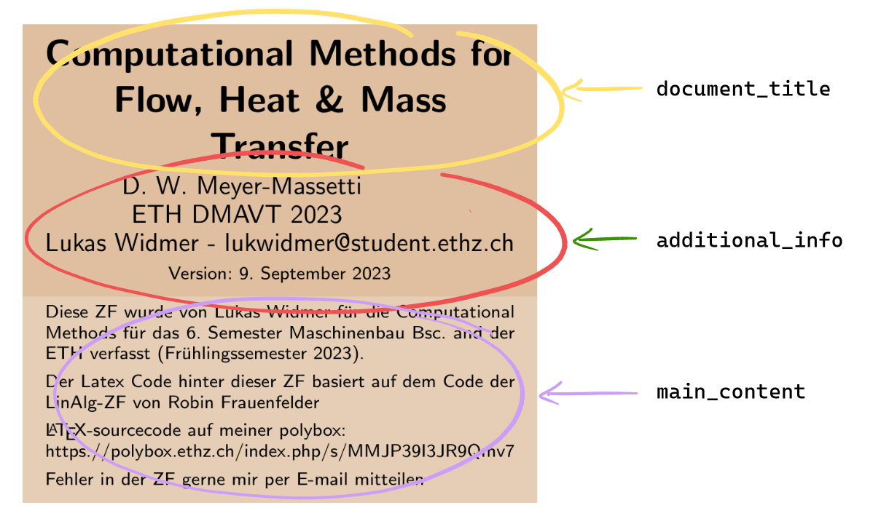
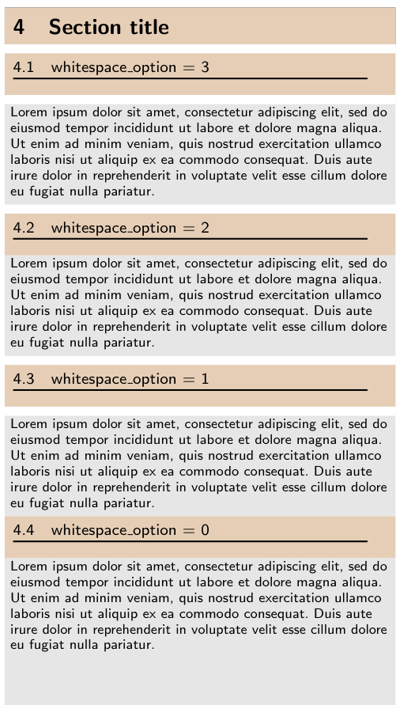
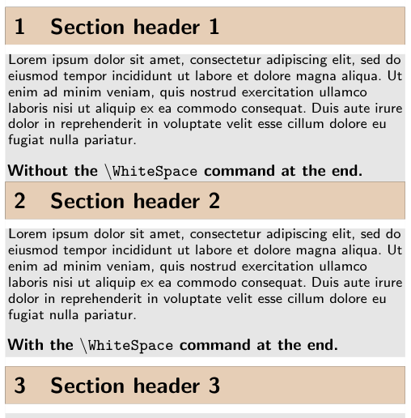
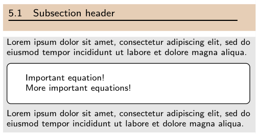

# ETH Zürich LaTeX cheat sheet Template

Welcome to my LaTeX cheat sheet template!
Since beginning my mechanical engineering studies in 2020, I've created cheat sheets for many courses in the program. With each new sheet, I've made improvements and updates, all of which are saved in this evolving template.
You can find all my cheat sheets and their source code both on my [github](https://github.com/lwidm/lwidm_latex_ZF_Template) and my [Polybox](https://polybox.ethz.ch/index.php/s/MMJP40I3JR9Qmv7)

**ETH Kürzel:** lukwidmer

## Table of Contents

- [Example cheat-sheet](#example-cheat-sheet)
- [Usage](#usage)
  - [Setup](#setup)
  - [Custom Commands](#custom-commands)
    - [`\DocumentInfo`](#\documentinfo[background_color]{document_title}{additional_info}{main_content})
    - [`\mySection`](#\mysection[background_color]{section_title})
    - [`\mySubsection`](#\mysubsection[background_color]{subsection_title}[whitespace_option]{main_body})
    - [`\phantomsubsection`](#\phantomsubsection{subsection_title})
    - [`\WhiteSpace`](#\whitespace)
    - [`\myBox`](#\mybox[background_color]{content})
    - [`\myCenter`](#\mycenter{content})
    - [`\circled`](#\circled{value})
    - [`\RomanNumeral`](#\romannumeral{number})
    - [`\diff`](#\diff{top_var}{bottom_var})
    - [`\partialdiff`](#\partialdiff{top_var}{bottom_var})
    - [`\unit`](#\unit[spacing_option]{unit_name})

## Example cheat-sheet



## Usage

### Setup

1. **Fork this repository** (or clone it and remove the origin remote).

```LaTeX
git clone --branch lightweight https://github.com/lwidm/ZF-Latex_Template-lukwidmer.git
cd eth-cheatsheet-template
git remote remove origin
```

- The lightweight branch does not include the entire documentation, instead it links to this README file for instructions.

2. **Change folder and file names** to match your course.
3. **Update all the comments** like:

```LaTeX
%!TEX root = ../ZF-LECTURE_NAME-lukwidmer.tex
```

These comments are located at the top of every chapter file, the header and the root file. Ensure they reflect your updated folder and file structure.

4. Add your content and compile the LaTeX document as needed!

### Custom Commands

The template defines several custom LaTeX commands to streamline content creation:

#### `\DocumentInfo[background_color]{document_title}{additional_info}{main_content}`

This command creates a customizable document information box at the top of the page.

- `[background_color]` (optional): Background colour of the box (default is `brown!37!white`)
- `{document_title}`: The title of the document
- `{additional_info}`: Extra info (e.g. author, lecturer, department, etc.)
- `{main_content}`: The main body of the document_info



#### `\mySection[background_color]{section_title}`

This command creates a custom section header box with optional background colour.

- `[background_color]` (optional): Background colour of the section header box (default is brown!38!white)
- `{section title}`: The title of the section

#### `\mySubsection[background_color]{subsection_title}[whitespace_option]{main_body}`

This command creates a custom subsection header box with optional background colour and control over white spaces around the subsection box.

- `[background_color]` (optional): Background colour of the subsection header box (default is brown!38!white)
- `{subsection_title}`: The title of the subsection.
- `[whitespace_option]`:
  - 0: No white space before or after the subsection the main body
  - 1: White space before the main body.
  - 2: White space after the main body.
  - 3: White spaces both before and after the main body.
- `{main_body}`: The content of the subsection (main text body).

<!--  -->


#### `\phantomsubsection{subsection_title}`

Creates a hidden subsection without rendering it visually, useful for adding links in the table of contents or navigation without modifying the layout.

#### `\WhiteSpace`

Adds a consistent white space in between sections or elements.

This command is typically used between sections to maintain consistent spacing throughout the document (often required after the end of a section with no subsections).

<!--  -->


#### `\myBox[background_color]{content}`

Creates a custom coloured box around a specified text block, useful for emphasizing key information.

- `[background_color]` (optional): Background colour of the box (default is brown!38!white).
- `{content}`: The content to be enclosed in the box.



#### `\myCenter{content}`

Centres the content horizontally within the page.

- `{content}`: The content to be centred.

#### `\circled{value}`

Encloses a number or letter inside a circle, often used for labels in ordered lists.

- `{value}`: The number, letter, or symbol to be circled.

#### `\RomanNumeral{number}`

Converts a given number to a Roman numeral.

- Example: `\RomanNumeral{5}` produces `V`.

#### `\diff{top_var}{bottom_var}`

Simplifies writing differential equations.

- Example: `\diff{x}{y}` produces $\frac{\mathrm{d}x}{\mathrm{d}y}$

#### `\partialdiff{top_var}{bottom_var}`

For partial differentials.

- Example: `\partialdiff{x}{y}` produces $\frac{\partial x}{\partial y}$

#### `\unit[spacing_option]{unit_name}`

Creates units with different formatting options (using the `mathrm` formatting for the unit itself).

- 0: No spacing.
- 1: Adds spacing between the value and the unit.
- 2: Adds square brackets around the unit.

- Example: `5\unit[1]{kJ}` produces: $5\hspace{4pt}\mathrm{kJ}$
